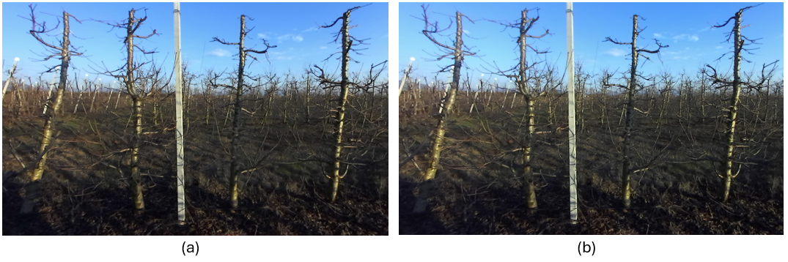
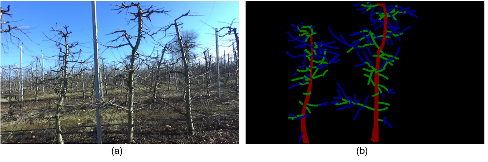
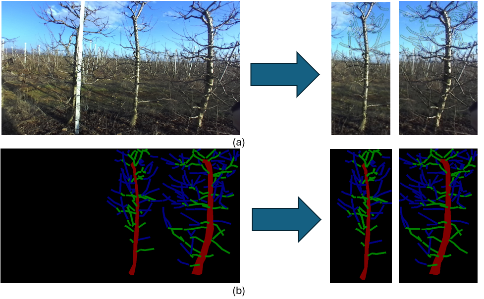

# AgriVision-Cherry Dataset

## Data Acquisition
  Dormant cherry trees of TSA configuration system were selected for the data collection. The farm was located in a semi-mountainous area of the Prefecture of Drama, in northern Greece, at the foot of Falakro mountain, at an altitude of 130 meters. All images were taken in January 2022 at a distance of about 2.5 meters from the tree line, in natural light conditions of full sunlight. The camera was held by hand at a consistent height of 1.5 m from the ground. Planting distances were 1.75 m on each line and 4 meters between the lines. The trees were 10 years old and had an average height of 3.5 m.
  In the structure of the trees, a central axis (trunk) perpendicular to the ground with a height of 3.5 m and several lateral horizontal branches appropriately distributed along the length of the trunk, of 30-70 cm long. Several secondary branches grow from them, almost horizontal, ending at the tips in annual shoots (limbs), of 10-80 cm long.
This linear system is accompanied by support including stakes (columns) and horizontal wires, to which the trunks of the young trees are tied at the points where the central trunk touches the wires, while all the lateral branches are never tied. In addition, the columns support anti-quartz nets at a height of 4.5 m from the ground.
  The farm included more than 10 varieties of cherry with different ripening times, all of which are grafted on Gisela-6 rootstock, suitable for Central Leader formation system. In this work, the data was collected from the following five varieties, aiming to adequately cover different varieties based on their different ripening time (two early, one mid-early, and two late ripening varieties): 

- Early: Early Bigi and Early Burlat, 
-	Mid-early: Grace Star, 
-	Late: Sweetheart and Skeena.

The created database consists of color images. Images were taken with a stereoscopic camera while walking along the tree lines and photographing the trees in pairs. A sample image is shown in Fig. 1.

Fig. 1. Indicative sample image of the formulated dataset. 

All images were captured with the ZED Mini Stereo Camera at relatively low resolutions. Its technical characteristics are presented in Table 1. 
Table 1. Technical characteristics of the used image sensor ZED Mini Stereo Camera. 
| Characteristic      | Value |
|-------------|--------------|
| Resolution  | Dual 4M pixel sensors of 2-micron pixels           |
| Sensor layout| Native 16:9 for a larger horizontal field of view |
| Sensor dimension  |1/3” BSI (backside illumination) sensor with high low-light sensitivity|
| Color camera settings  | Adjust resolution, frame rate, brightness, contrast, saturation, gamma, sharpness, exposure, white balance          |
| Frames per second (FPS)      | 100 Hz |
| Depth range| 10 cm to 15 m |
| Field of view| 90° horizontal, 60° vertical, 100° diagonal max |

The following set of images were acquired:
-	87 images from the Early Bigi variety
-	44 images of the Early Burlat variety
-	97 images of the Grace Star Mid-early variety
-	23 images of the Late Sweetheart variety
-	38 images of Late variety Skeena.

In total, 289 color images were acquired from all five varieties. From this dataset some images were not clear enough to facilitate annotations and were excluded, while the sharpest ones were chosen, depicting 2-4 trees at most with all their branches distinct and without overlapping or obstructions, concluding in 80 image samples.

## Dataset Annotation
In this work, three classes have been identified: (1) the trunk, (2) the thick branches, and (3) the thinner annual shoots, namely limbs. Annotation was done manually by using the LabelMe annotation tool. The annotation of the trunk was done with a closed curved line on the outline of the trunk including its entire area. The annotation of branches was done with straight and polygonal lines of the same thickness, without taking into account the thickness of each branch, for simplification. The annotation of limbs was also done with straight and polygonal lines of the same thickness, without considering the thickness of each branch. Fig. 2 shows the annotation of 3 classes for an image depicting two cherry trees.

Fig. 2. (a) Original image and (b) annotation of the image depicting two trees; trunks are marked with red, branches with green, and limbs with blue lines. 

### 📌 **Tree Isolation Process**
In order to increase the number of images of the final AgriVision-Cherry dataset to train robust models, a supporting algorithm was implemented to isolate separate indicative trees from each image, as illustrated in Fig. 3. The latter resulted in a final dataset of 321 images of separate trees and their corresponding annotations.

Fig. 3. Isolation of trees towards creating a big dataset of (a) real color images, (b) along with their annotations.

**Files contain the following:**
1.	Raw dataset: 80 color images of 2-4 trees
2.	AgriVision dataset: 321 images of single trees with annotations

---

## 📜 Citation

> **Axios Kefalas, Theofanis Kalampokas, Eleni Vrochidou, George A. Papakostas**  
> *A Vision-Based Pruning Algorithm for Detecting Tree Structure Elements and Exact Pruning Points in Dormant Cherry Trees Using Deep Learning and RGB Images*,  
> Submitted to Computers and Electronics in Agriculture, 2025.

---
